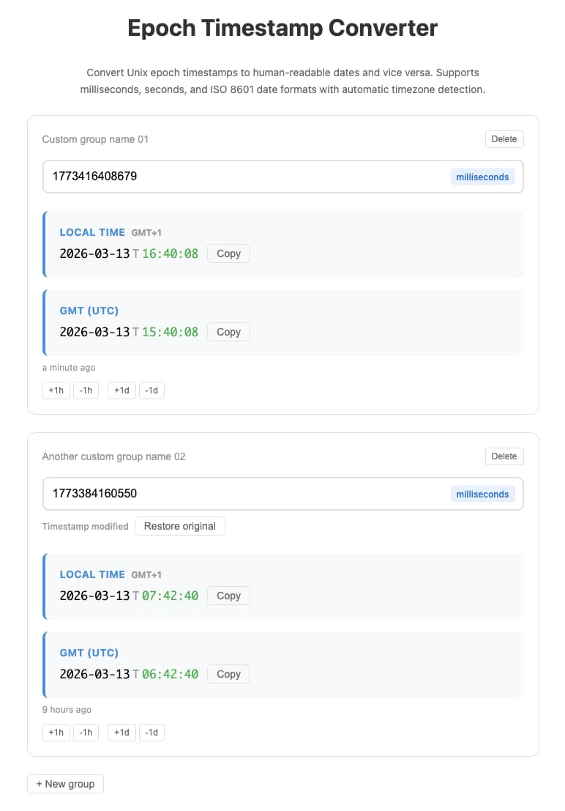

# Unix epoch timestamp converter

Convert between epoch timestamps (milliseconds, seconds or ISO 8601) and human-readable dates with automatic timezone detection.

**URL** https://epoch.icaruk.dev/

## Features

- Convert Unix epoch timestamps to dates and vice versa
- Support for:
	- milliseconds
	- seconds
	- ISO 8601
- Automatic timezone detection
- Multiple timestamp groups
- Relative time display
- Quick time adjustment (+1h, -1h, +1d, -1d)
- One-click copy to clipboard
- LocalStorage persistence
